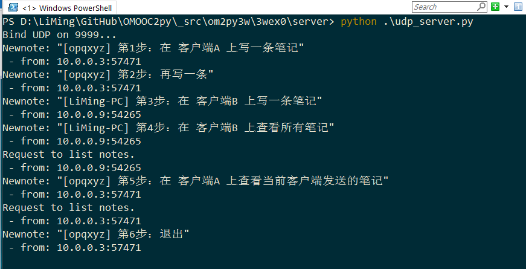
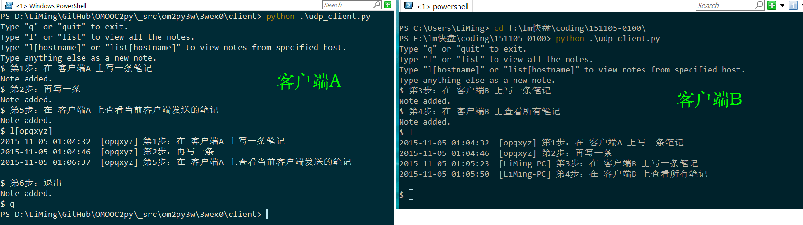

## Easynote UDP网络版 开发笔记
* 环境：
    * Windows 10
    * Powershell (in conEmu)
    * Active Python 2.7.8.10

### v0 -- 实现基本功能
#### 模版代码
在《网络编程 ：一些基本知识》文中，我们已经熟悉了实现基本 UDP 通信的模版代码：
* 服务端

```
import socket

s = socket.socket(socket.AF_INET, socket.SOCK_DGRAM)

s.bind(('127.0.0.1', 9999))
print 'Bind UDP on 9999...'
while True:
    data, addr = s.recvfrom(1024)
    s.sendto('msg received', addr)
```

* 客户端

```
import socket

s = socket.socket(socket.AF_INET, socket.SOCK_DGRAM)
data = 'some string'
s.sendto(data, ('127.0.0.1', 9999))
s.close
```

#### 添加动作
接下来只需把文本信息的传递、读写文本文件的动作添加进去。梳理一下两类动作的流程：
* 新建笔记:
    * C：输入note -> sendto server
    * S：recv note -> 写入文件
* 列出笔记:
    - C: 输入list请求
    - S: 接收list请求 -> get notes from file -> sendto client
    - C: 接收notes -> 输出到屏幕

其中，服务端写入和读取文件的动作可以直接调用 0wex1 的现有函数，这与 2wex0 的做法相同。

#### V0 代码
服务端

```
#!/usr/bin/env python
# -*- coding: utf-8 -*-
import socket
import Easynote as EZ

s = socket.socket(socket.AF_INET, socket.SOCK_DGRAM)

s.bind(('127.0.0.1', 9999))
print 'Bind UDP on 9999...'
while True:
    data_recv, addr = s.recvfrom(1024)
    if data_recv.lower() == 'list':
        notes = EZ.GetNotes('all') # 从 mynotes.txt 获取 notes
        if notes == '': # 该返回值表示 文件尚未创建
            data_send = 'Nothing on server.'
        else:
            data_send = ''.join(notes['notes'])
        print 'Request to list notes.\n- from: %s:%s' % addr
    else:
        EZ.NewNote(data_recv)
        data_send = 'Note added.'
        print 'Newnote: "%s"\n- from: %s:%s' % (data_recv, addr[0], addr[1])
    s.sendto(data_send, addr)
```

客户端

```
#!/usr/bin/env python
# -*- coding: utf-8 -*-
import socket

s = socket.socket(socket.AF_INET, socket.SOCK_DGRAM)

print 'Type "exit" or "quit" or "q" to exit.'
print 'Type "list" to print existing notes.'
print 'Type anything else as a new note.'

while True:
    input = raw_input('$ ').strip()
    if input.lower() in ['exit','quit','q']:
        break
    s.sendto(input, ('127.0.0.1', 9999))
    print s.recv(1024)
s.close
```

### v1 -- 完善与升级
#### 想法及实现
* 如何保存笔记的客户端来源？
    - 客户端来源用什么信息区分？
         + IP可能是变化的
         + 最好是 计算机名
    - 如何获取计算机名？
        + google：python get computer name，从[第一个结果](http://stackoverflow.com/questions/799767/getting-name-of-windows-computer-running-python-script)了解到有三种方法：
            * `socket.gethostname()` <- 正好是 socket 模块的
            * `platform.node()`
            * `os.environ['COMPUTERNAME']`
    - 如何实现
        + 在客户端发送的笔记内容中增加 hostname
* 如何按主机名查看笔记
    - 把主机名传入 GetNotes 函数
    - 在 GetNotes 函数中，通过对内容进行筛选，得到符合要求的笔记，作为函数返回值
* V1 代码：详见 [Github 代码目录](https://github.com/sunoonlee/OMOOC2py/tree/master/_src/om2py3w/3wex0)

#### V1 演示截图
* 服务端



* 客户端



### 进展
* 151102 创建
* 151104 更新到 V1
* 151108 拆分为基本知识与开发记录两部分