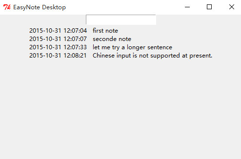

## easynote 桌面版 v0 介绍

### 程序功能及界面

* 在输入框中输入笔记, 按回车键完成输入并保存至 mynotes.txt 文件.
* 输入框下方实时显示 mynotes.txt 文本内容
* 程序界面如图所示:

### 技术要点

* 主程序代码为 main.py, 其中新建笔记和获取已有笔记时调用了 easynote 模块. 后者由 0wex1 的 easynote cli 版代码修改而来. 
* 使用了 Entry 和 Lable 两种 Tkinter widget
* 在 Entry 插件上 把回车键和 newnote 方法绑定
* 尚未解决中文支持问题