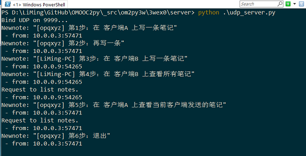
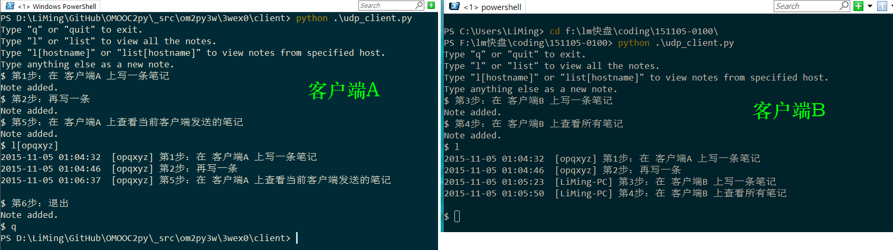

### easynote UDP网络版 v1.0

#### 功能及说明
极简交互式笔记的网络版本
* 服务端
    - 运行 [server/udp_server.py](server/udp_server.py)
    - 接收客户端输入的笔记，保存到 mynotes.txt
        - 保存时自动添加当前时间和来源主机名
    - 接收并响应客户端读取笔记请求
* 客户端
    - 运行 [client/udp_client.py](client/udp_client.py)
    - 写笔记：输入文字并回车
    - 查看笔记：
        - `list` 列出所有笔记
        - `list[hostname]` 列出指定主机发送的笔记
    - 退出：输入 `exit`, `quit` 或 `q`

#### 使用演示
服务端

客户端

#### 技术要点

* socket 模块的简单应用
    - 创建，bind, sendto, recvfrom
    - socket address 的格式：('127.0.0.1', 9999)
* 调用 Easynote.py 里的 NewNote() 及 GetNotes() 函数