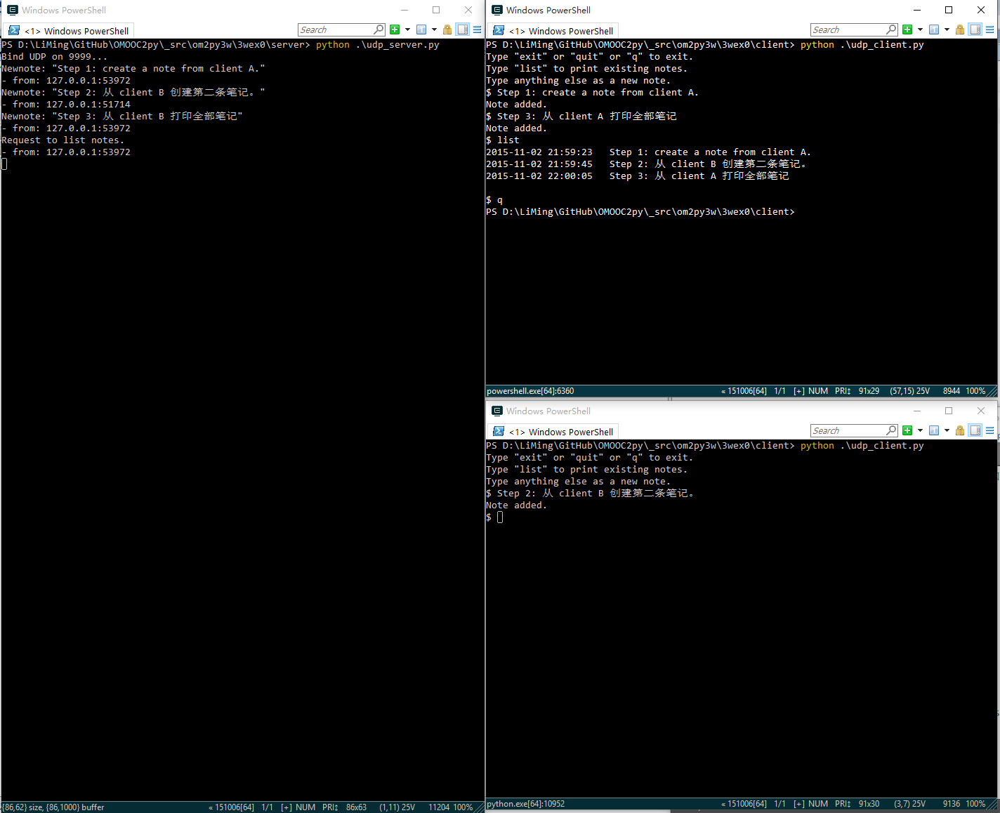

# easynote UDP网络版 开发笔记

## 第一部分 背景知识
### 1.0 问题

C/S如何传输信息，什么是UDP、socket，如何用python实现？
>首先先明确如何进行网络开发?
什么是  UDP 协议?
用 Python 完成一对最简单的 UDP 服务器/客户端?
 
### 1.1 关于互联网协议
 
参考：
* 阮一峰：[互联网协议入门（一）](http://www.ruanyifeng.com/blog/2012/05/internet_protocol_suite_part_i.html)
* [互联网协议入门（二）](http://www.ruanyifeng.com/blog/2012/06/internet_protocol_suite_part_ii.html)
 
#### 五个层次
* 实体层
* 链接层
    - 以太网(Ethernet)协议
    - 以太网数据包叫做 帧（Frame），包含Head和data
        - Head 包含发送者、接受者、数据类型等信息，长度 18 字节
        - data 长度 46~1500 字节
    - MAC地址：12个16进制数，用来识别设备
    - 广播 broadcasting
* 网络层
    - 互联网由无数个子网络组成
    - 主机到主机的通信
    - IP协议：IP地址，子网掩码
    - IP数据包：总长度最大 65535 字节，常常分隔成多个以太网数据包
    - ARP协议：由IP地址获取MAC地址
* 传输层
    - 端口到端口的通信，每个端口对应一个程序
    - Unix系统就把主机+端口，叫做"套接字"（socket）
    - 在数据包中加入端口信息需要新的协议
        + UDP协议：最简单，加一个8字节的端口号信息
        + TCP协议：可以简单理解为，有确认机制的UDP协议
            * 能够确保数据不会遗失
            * 缺点是过程复杂、实现困难、消耗较多的资源
* 应用层
    - 规定应用程序的数据格式
 


更多资料：
* [Introduction to the Internet Protocols](http://www.uic.edu/depts/accc/network/ftp/v452.html)
 
#### 用户角度的实现
* 上网设置
    - 四个参数：本机IP，子网掩码，网关IP，DNS IP
    - 静态IP
    - 动态IP：
        + DHCP协议
* 一个实例：访问网页
 
### 1.2 进一步了解 socket、UDP
1、[Socket Programming HOWTO](https://docs.python.org/2/howto/sockets.html)
* this doc only talks about: INET sockets, STREAM socket
* blocking and non-blocking sockets
* “client” socket vs. “server” socket
    * a “client” socket: an endpoint of a conversation
    * a “server” socket: more like a switchboard operator
    * The client application uses “client” sockets exclusively; the web server it’s talking to uses both “server” sockets and “client” sockets.
 
2、廖雪峰：[TCP 编程](http://www.liaoxuefeng.com/wiki/001374738125095c955c1e6d8bb493182103fac9270762a000/001386832511628f1fe2c65534a46aa86b8e654b6d3567c000)，[UDP 编程](http://www.liaoxuefeng.com/wiki/001374738125095c955c1e6d8bb493182103fac9270762a000/0013868325264457324691c860044c5916ce11b305cb814000)
* 创建Socket时
    * AF_INET指定使用IPv4协议
    * SOCK_STREAM 指定为TCP协议
    * SOCK_DGRAM 指定为UDP协议
* 端口号
    * 80端口是Web服务的标准端口
    * 其他服务都有对应的标准端口号，例如SMTP服务是25端口，FTP服务是21端口
    * 端口号小于1024的是Internet标准服务的端口，端口号大于1024的，可以任意使用
* TCP连接创建的是双向通道
* 相对TCP，UDP则是面向无连接的协议
* 使用UDP协议时，不需要建立连接，只需要知道对方的IP地址和端口号，就可以直接发数据包
 
3、**结合[pydoc 17.2 - socket](https://docs.python.org/2/library/socket.html)，熟悉廖雪峰的[示例代码](https://github.com/michaelliao/learn-python/tree/master/socket)**
- bind 方法的参数应该是个元组
    - 敲示例代码时少输了一层括号，结果报错：`TypeError: bind() takes exactly one argument (2 given)`
- recvfrom 方法：
    + 参数：bufsize，即 The maximum amount of data to be received at once
        * 超过 bufsize 会怎样？动手试了一下，报错`socket.error: [Errno 10040]`
    + 返回值：(string, address)。这与sendto方法的参数相同。
- sendto 方法
- socket address 的格式：(host, port)
    + host: like 'daring.cwi.nl' or '100.50.200.5'
    + port: an integer

### 1.3 A Little More Info from <python 基础教程>
python基础教程-CH14 网络编程
* 功能强大的 urllib和urllib2 模块：
    - 通过它们在网络上访问文件，就像访问本地电脑上的文件一样
* SocketServer 模块：实现更高级的服务器框架需求，如分叉和线程处理
* Twisted: 事件驱动的python网络框架
    - 可以很好地与GUI工具包协同工作
 
## 第二部分 编程实现任务

### v0 -- 实现基本功能
#### 模版代码
在上面 1.2 节中，我们已经熟悉了实现基本 UDP 通信的模版代码：
* 服务端

```
import socket

s = socket.socket(socket.AF_INET, socket.SOCK_DGRAM)

s.bind(('127.0.0.1', 9999))
print 'Bind UDP on 9999...'
while True:
    data, addr = s.recvfrom(1024)
    s.sendto('msg received', addr)
```

* 客户端

```
import socket

s = socket.socket(socket.AF_INET, socket.SOCK_DGRAM)
data = 'some string'
s.sendto(data, ('127.0.0.1', 9999))
s.close
```

#### 添加动作
接下来只需把文本信息的传递、读写文本文件的动作添加进去。梳理一下两类动作的流程：
* 新建笔记:
    * C：输入note -> sendto server
    * S：recv note -> 写入文件
* 列出笔记:
    - C: 输入list请求
    - S: 接收list请求 -> get notes from file -> sendto client
    - C: 接收notes -> 输出到屏幕

其中，服务端写入和读取文件的动作可以直接调用 0wex1 的现有函数，这与 2wex0 的做法相同。

#### V0 界面



#### V0 代码
服务端

```
#!/usr/bin/env python
# -*- coding: utf-8 -*-
import socket
import Easynote as EZ

s = socket.socket(socket.AF_INET, socket.SOCK_DGRAM)

s.bind(('127.0.0.1', 9999))
print 'Bind UDP on 9999...'
while True:
    data_recv, addr = s.recvfrom(1024)
    if data_recv.lower() == 'list':
        notes = EZ.GetNotes('all') # 从 mynotes.txt 获取 notes
        if notes == '': # 该返回值表示 文件尚未创建
            data_send = 'Nothing on server.'
        else:
            data_send = ''.join(notes['notes'])
        print 'Request to list notes.\n- from: %s:%s' % addr
    else:
        EZ.NewNote(data_recv)
        data_send = 'Note added.'
        print 'Newnote: "%s"\n- from: %s:%s' % (data_recv, addr[0], addr[1])
    s.sendto(data_send, addr)
```

客户端

```
#!/usr/bin/env python
# -*- coding: utf-8 -*-
import socket

s = socket.socket(socket.AF_INET, socket.SOCK_DGRAM)

print 'Type "exit" or "quit" or "q" to exit.'
print 'Type "list" to print existing notes.'
print 'Type anything else as a new note.'

while True:
    input = raw_input('$ ').strip()
    if input.lower() in ['exit','quit','q']:
        break
    s.sendto(input, ('127.0.0.1', 9999))
    print s.recv(1024)
s.close
```

### 进展
151102 创建