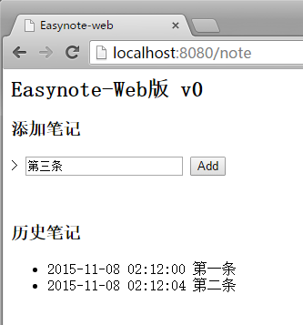
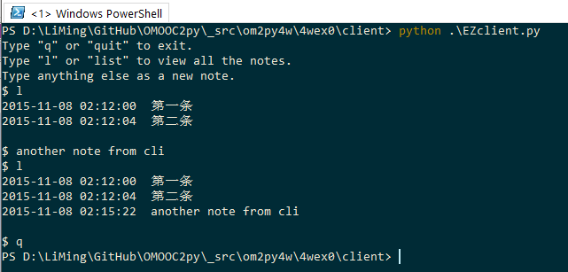

### Easynote Web版 v0 功能及说明

极简交互式笔记的 web 版本, 并兼容命令行交互方式
* 服务端
    - 运行 [server/EZserver.py](server/EZserver.py), 需安装 bottle 模块
    - 笔记存储在 `mynotes.txt`
* 浏览器交互
    - 访问 http://localhost:8080/note
    - 界面如图

    

* 命令行交互
    - 运行 [client/EZclient.py](client/EZclient.py)
        - 需安装模块：[requests](http://docs.python-requests.org/en/latest/), [bs4](http://www.crummy.com/software/BeautifulSoup/bs4/doc/)
    - 添加笔记：输入文字并回车
    - 查看笔记：输入 `list` 或 `l`
    - 退出程序：输入 `quit` 或 `q`
    - 界面如图
    
    