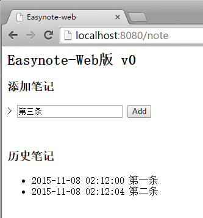

## Easynote Web版 开发笔记
* 环境：
    * Windows 10
    * Powershell (in conEmu)
    * Active Python 2.7.8.10
    * 浏览器：Chrome

### v0 实现基本功能
#### 实现网页的基本交互
##### bottle 初印象
一开始先读 Bottle tutorial，因为对相关背景知识不了解，所以读得似懂非懂。初步的印象是，bottle 框架在 python 中的使用方法与 Tkinter 类似，前者是用 decorator 把 url 与函数绑定，后者是用 bind 方法把事件和函数绑定。

##### 实现新增笔记
参照 tutorial 中 POST 方法的示例代码，可以方便地实现"新增笔记"这个动作：把新笔记作为表单内容，用 request.forms.get 获取内容，调用已有的 NewNote 函数写入文件。
```python
from bottle import request
note = request.forms.get('newnote')
if note:
    Easynote.NewNote(note)
```

##### 实现历史笔记的显示
接下来，实现历史笔记的显示需要费一些周折。一般建议把 html 文本和 py 代码分离。可以利用 bottle 内置的 SimpleTemplate Engine 做一个 html 模版。了解了一些简单的 html 标签后，我选用 `<li>` 标签来显示笔记条目。SimpleTemplate 支持在模版文件中使用类似 python 的简单语法，用 for 循环遍历笔记列表，可以把笔记逐条显示：
```html
% for note in notes:
   <li>{{note}}</li>
% end
```

做好模版后，可以把通过 GetNotes() 从文件中读取到的笔记内容，当作参数传给模版，作为 get 和 post 对应函数的返回值：
`return template('EZ_template', notes=notes)`

##### 服务端主要代码
v0
```python
from bottle import get, post, template, request, run
import Easynote

@get('/note')
def ShowPage():
    notes = Easynote.GetNotes()
    return template('EZ_template', notes=notes)

@post('/note')
def CreateNote():
    note = request.forms.get('newnote')
    if note:
        Easynote.NewNote(note)
    notes = Easynote.GetNotes()
    return template('EZ_template', notes=notes)

run(host='localhost', port=8080, debug=True, reloader=True)
```

#### 实现对命令行界面的兼容
##### 没有头绪，回头补基础知识
完成上一部分后，我满以为本周的基本任务已经大体完成了。这时注意到任务要求里还有这行字：
> 同时兼容 3w 的 Net 版本的命令行界面进行交互

如何让一个 web 程序兼容命令行交互？以我现有的知识，真是一点头绪都没有。
* 沿用上周的 udp 客户端代码是行不通的，因为服务端并没有定义相应的响应行为
* 研究了一下公开课介绍的 curl，看帮助文档看的一头雾水。文档里好像只讲了 curl 在命令行中的用法，不知道怎么用在代码中。


于是我断定自己还是缺乏 web 开发的基本概念，决定再从基本知识补起。读了一些资料，了解到：
* HTTP 协议大致是怎么回事
* 什么是 WSGI 接口
* web 框架如何在 WSGI 的基础上做了进一步的抽象
* 大致了解什么是 RESTful 风格
* 上一篇文《WEB 开发 ：一些基本知识》，除了bottle框架的部分外，主要都是这个过程中所做的笔记。


直到读到这篇文章 - [Communicating with RESTful APIs in Python](http://isbullsh.it/2012/06/Rest-api-in-python/)，我才明白如何借助于 RESTful API 调用 HTTP 的数据，而不是在 socket 这种层面上。实际上，具体的实现方式是比较简单的，特别是文中推荐的 requests 库具有非常简洁清晰的逻辑，官方文档也很明白易读。所以之前卡住的原因还是在于对基本概念缺乏理解。

##### 利用 requests 操作 http 数据
安装了 requests 模块后，对照着官方文档中的 [quickstart](http://docs.python-requests.org/en/latest/user/quickstart/)，我先在 python 交互环境下试验了：
* 用 requests 完成 post 动作

```python
import requests
requests.post('http://localhost:8080/note', data = {'newnote':note})`
```

* 获取 html 文本 

```python
r = requests.get('http://localhost:8080/note')`
html_doc = r.text
```

用其他类似功能的模块，比如 urllib2, httplib2, pycurl 等，应该也可实现这些目的，只是代码可能不如 requests 简洁。

##### 从 html 中获取历史笔记信息
用上边的 `r.text` 获得的是整个 html 文件的内容，需要从中分离出历史笔记内容。

参考《python 基础教程》15.1节，一种思路是用正则表达式去搜索，但这种方式是比较原始粗暴的，不易写, 也不易读；书中推荐用 Beautiful Soup 库。

Beautifil Soup 最新版本为 4.4 版，官方文档有[中文版](http://www.crummy.com/software/BeautifulSoup/bs4/doc.zh/)。完成本任务只需看“快速开始”部分，熟悉几个最基本方法。因为我的 html 模版中，历史笔记每条都对应一个`<li>`标签，所以可以用 `find_all('li')` 获得全部笔记的列表 `lis`。
```python
from bs4 import BeautifulSoup
soup = BeautifulSoup(r.text,'html.parser')
lis = soup.find_all('li')
```

需要注意的是 lis 列表中的元素还不是我们需要的字符串，而是 Beautiful Soup 定义的某种对象。可以用 get_text() 方法得到字符串。
```python
notes = ''
for i in lis:  notes += i.get_text()
```

至此，实现命令行交互所遇到的问题基本得到解决。

##### 命令行客户端代码
v0
```python
import requests
from bs4 import BeautifulSoup

def main():
    print 'Type "q" or "quit" to exit.'
    print 'Type "l" or "list" to view all the notes.'
    print 'Type anything else as a new note.'

    while True:
        INPUT = raw_input('$ ').strip()
        inp = INPUT.lower()
        if inp in ['quit','q']:
            break
        elif inp in ['list','l']:
            print listnotes()
        else:
            addnote(INPUT)

def addnote(note):
    requests.post('http://localhost:8080/note', data = {'newnote':note})

def listnotes():
    r = requests.get('http://localhost:8080/note')
    soup = BeautifulSoup(r.text,'html.parser')
    lis = soup.find_all('li')
    notes = ''
    for i in lis:
        notes += i.get_text()
    return notes

if __name__ == '__main__':
    main()
```

#### v0 程序界面
* 浏览器交互



* 命令行交互


### 迭代记录
#### 数据存储方式改为  SQLite 数据库
把服务端程序调用的 Easynote.py 改写为：
```py
# -*- coding: utf-8 -*-
# SQLite 数据库版
from os.path import exists
import sqlite3
from datetime import datetime

dbfilename = "mynotes.db"
        
def NewNote(note):
    con = sqlite3.connect(dbfilename)
    time = str(datetime.now())[:19] # 去掉秒数的小数部分
    with con:
        cur = con.cursor()
        cur.execute("CREATE TABLE IF NOT EXISTS Notes(Id INTEGER PRIMARY KEY, Time TEXT, Content TEXT)")
        cur.execute("INSERT INTO Notes(Time, Content) VALUES(?,?)", (time, note))

def GetNotes(): # 返回全部笔记的列表
    if exists(dbfilename):
        con = sqlite3.connect(dbfilename)
        allnotes = []
        with con:
            con.row_factory = sqlite3.Row
            cur = con.cursor()
            cur.execute("SELECT * FROM Notes")
            rows = cur.fetchall()       
            for row in rows:
                allnotes.append('%s  %s' % (row['Time'], row['Content']))
        return allnotes
    else:
        return ['No data on server']
```

输入英文ok，但输入中文时服务器端报错。
```
 cur.execute("INSERT INTO Notes(Time, Content) VALUES(?,?)", (time, note))
ProgrammingError: You must not use 8-bit bytestrings unless you use a text_factory that can interpret 8-bit bytestrings (like text_factory = str). It is highly recommended that you instead just switch your application to Unicode strings.
```

尝试解决：
将 `note = request.forms.get('newnote')` 改为`note = unicode(request.forms.get('newnote'), 'utf-8')`后，网页端输入中文ok，但命令行下输入中文会报错：
```
note = unicode(request.forms.get('newnote'), 'utf-8')
UnicodeDecodeError: 'utf8' codec can't decode byte 0xd6 in position 0: invalid continuation byte
```

中文编码问题还没有很好地理解，明天读些文章再补补课。

#### 改用 jinja2 模版
jinja2 官方文档对初学而言嫌繁杂了。本周任务不需要复杂的模版功能。从 bottle 内置的 simpleTemplate 改为 jinja2 模版，只需：
* 在服务端py代码中改用 jinja2_view() decorator
* 修改模版中类python的语句格式，例如
    - `% for note in notes:` 改为 `` 
    - `% end` 改为 ` ` 

#### 使用 bootstarp
浏览了官网上的简介和 getting started，尝试了最简单的 [starter-template 示例](http://getbootstrap.com/examples/starter-template/)

把原来 html 的内容添加到这个 starter-template 里，算是完成了页面的初次美化。其实还是蛮丑的，有时间再慢慢美化吧。

### 进展
* 151113 使用 bootstrap
* 151111 改用 jinja2 模版
* 151110 改用 SQLite 数据库
* 151108 创建
* 附：[Github 代码目录](https://github.com/sunoonlee/OMOOC2py/tree/master/_src/om2py4w/4wex0)