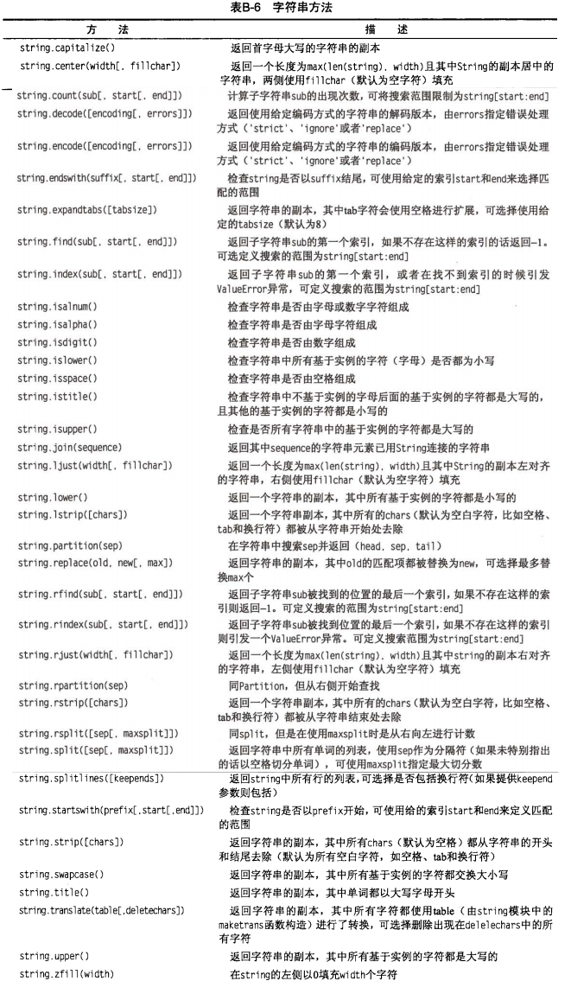

# Python Strings
## Google python class - Strings
结合 《python 基础教程》

### 一些零碎知识
字符串换行的两种方法：
* 行末加 \，或
* 用三个引号

Python strings are "immutable"
* same as Java strings

标准的序列操作对字符串同样适用，包括：
* 索引，slice, 乘法，in，len, max, min
* Python tries to make its operations work consistently across different types
* don't use "len" as a variable name to avoid blocking out the len() function

注意 `print sth` 与 `print sth,` 的区别

A 'u' prefix allows you to write a unicode string literal

Python does not have a separate character type

### String methods

速查表

Mark 几个：
* s.startswith(), s.endswith()
* s.replace('old','new')
* s.join()

更多参阅 [Pydoc 5.6.1 String Methods](https://docs.python.org/2/library/stdtypes.html#string-methods)

### String Slices
* 对于s[start:end]，start 或 end 空缺时表示从头/尾开始
* -n 表示倒数第 n 位
* 'Hello'[1:100] is 'ello'
    * an index that is too big is truncated down to the string length
* for any index n, s[:n] + s[n:] == s

### String %

### i18n Strings (Unicode)

### If Statement

### Exercise
string1.py, string2.py in:
[Basic Python Exercises](https://developers.google.com/edu/python/exercises/basic?hl=zh-CN)
